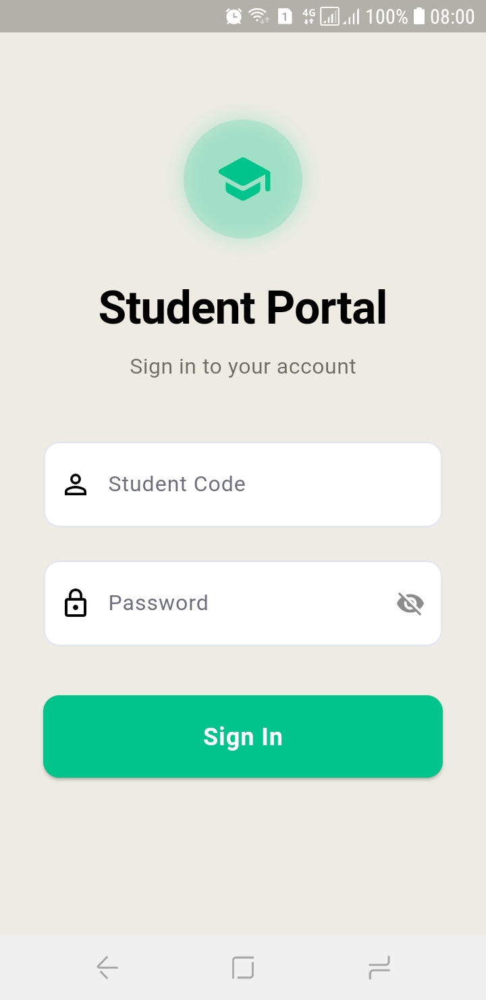
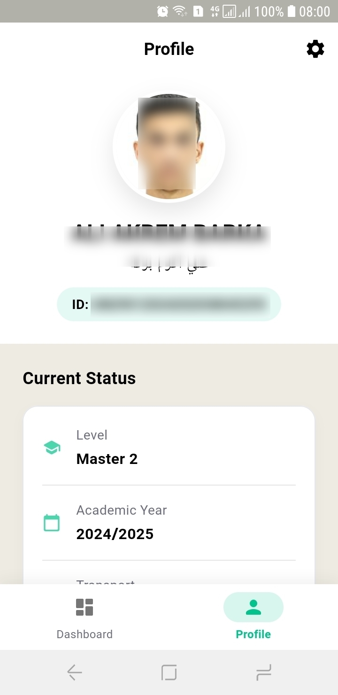
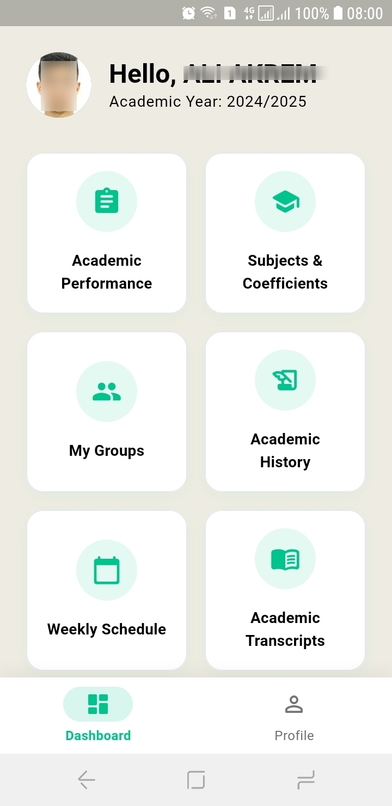
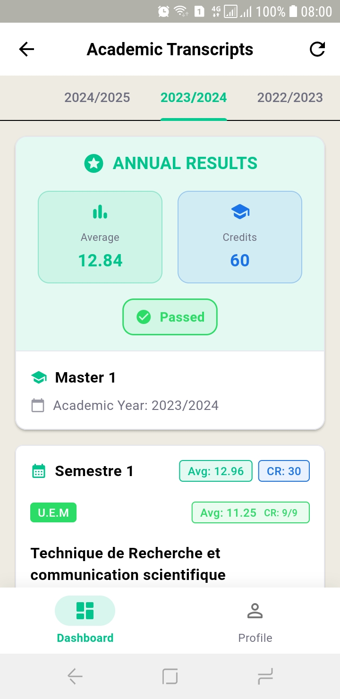
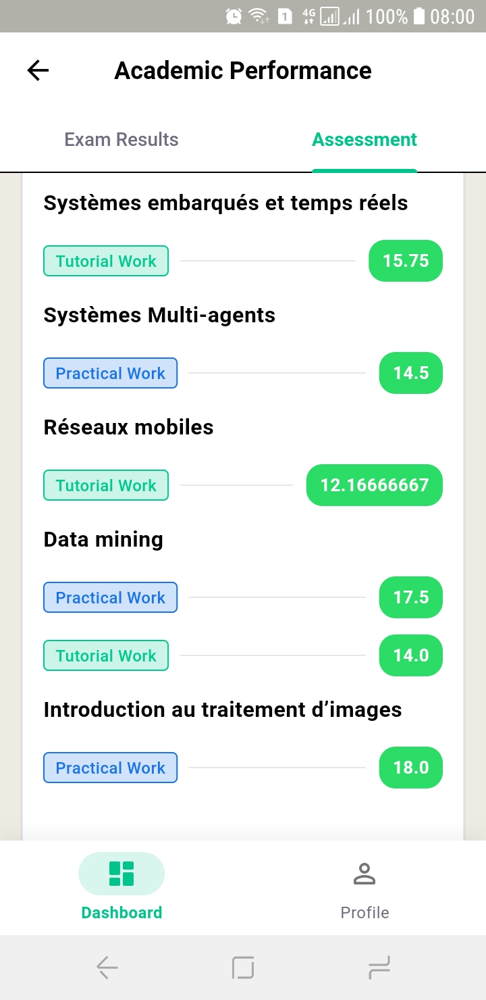
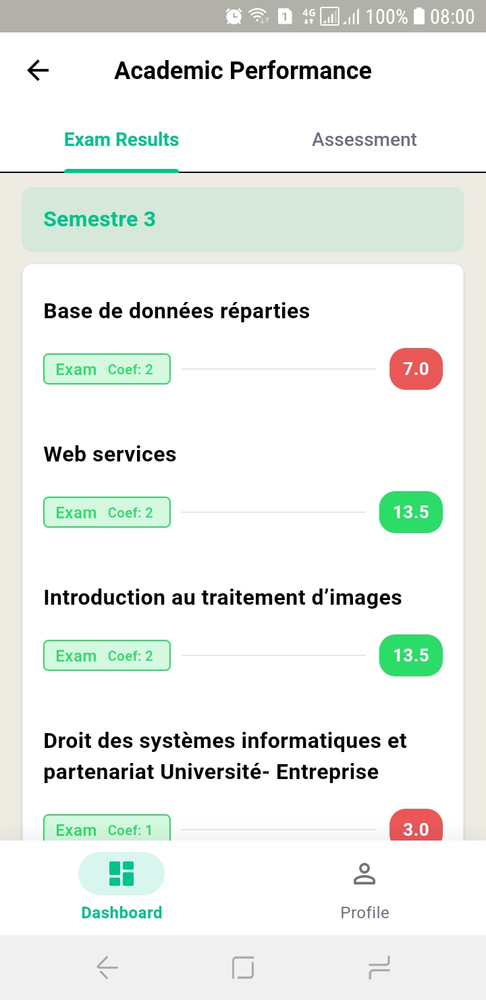
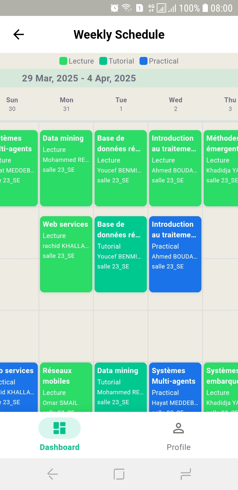

# Progres

[](https://progres.en.uptodown.com/android)

Progres is an independently developed remake of Progres/Webetu with a focus on enhanced user experience.


I built this app because the original student portal (Progres/Webetu) is... well, not the best. It’s slow, outdated, and not very user-friendly. I wanted something faster, cleaner, and more reliable
So I decided to rebuild it from scratch, with a better design and offline support. It's open-source too, so that anyone can improve it.

> **Note:** This application is not officially affiliated with Progres/Webetu or any educational institution.

## Key Features

- **Modern UI/UX** - Intuitive interface built with Material Design 3
- **Bilingual Support** - Full support for both Arabic scripts
- **Enhanced Performance** - Optimized for speed and reliability

## Screenshots

<p align="center">
  
   
  
</p>

<p align="center">
  
  
  
  
</p>

## App Modules

 - **Authentication**
 - **Student Profile**
 - **Academic Records**
 - **Performance Tracking**
 - **Academic history**
 - **Weekly Timeline**


## Technical Details

### Built With
- Flutter for cross-platform compatibility
- BLoC pattern for state management
- local storage for offline capabilities

### Architecture
- Clean architecture with separation of concerns
- Repository pattern for data management

## Getting Started

### Prerequisites
- Flutter SDK (version 3.22.2)
- Dart SDK (version 3.4.3) 

### Run Locally

1. Clone the repository
   ```bash
   git clone https://github.com/aliakrem/progres.git
   ```

2. Navigate to project directory
   ```bash
   cd progres
   ```
   
3. Install dependencies
   ```bash
   flutter pub get
   ```

4. Run the app
   ```bash
   flutter run
   ```

## In The Future  

- [x] Arabic language support
- [ ] Push notifications for grade updates
- [ ] Push notifications for courses start
   
## Contributing

[View contributing guidelines](https://github.com/AliAkrem/progres/blob/master/CONTRIBUTING.md)

## License

This project is licensed under the MIT License - see the [LICENSE](LICENSE) file for details.


---

<p align="center">
  Made with ❤️ by 
</p>
<p align="center">
  <a href="https://github.com/aliakrem/progres/graphs/contributors">
    
  </a>
</p>
